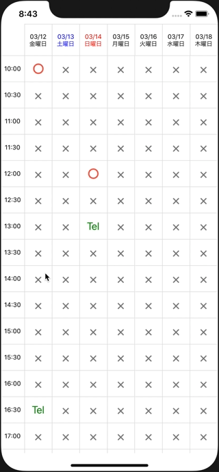

# react-native-booking-calendar

calendar component for booking app



## Installation

```sh
npm install react-native-booking-calendar
```

## Dependencies

```sh
npm install luxon
npm install --save-dev @types/luxon
```
if you want to use Intl API in luxon, see https://github.com/react-native-community/jsc-android-buildscripts


## Usage

```js
const startDate = DateTime.local(2021, 3, 12).setLocale('ja');
const startTime = new Date();
startTime.setHours(9);
startTime.setMinutes(30);
const endTime = new Date();
endTime.setHours(19);
endTime.setMinutes(0);

export default function App() {
  const onButtonPress = (d: DateTime) => {
    console.log(d);
  };
  const dateTimeObj = {
    '2021-3-14': {
      '12:00': { row: <Text>〇</Text>, onPress: onButtonPress },
      '13:00': { row: <Text>Tel</Text>, onPress: onButtonPress },
    },
  };

  const defaultRow = {
    row: <Text>× </Text>,
    onPress: onButtonPress,
  };

  return (
    <ScrollView>
      <BookingCalendar
        defaultRow={defaultRow}
        startDate={startDate}
        startTime={startTime}
        endTime={endTime}
        intervalMinutes={30}
        dateTime={dateTimeObj}
        backgroundColor="#e0e0e0"
        borderColor="pink"
        fontColor="blue"
      />
    </ScrollView>
  );
}
```

## Contributing

See the [contributing guide](CONTRIBUTING.md) to learn how to contribute to the repository and the development workflow.

## License

MIT
